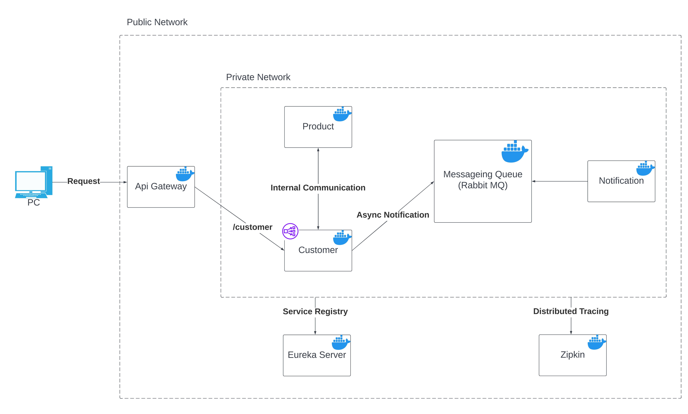

# microservices-demo

Components Diagram:-

This demo shows the use of many microservices related concepts in Java such as: -

- Service Discovery Using **Eureka**.
- Use of uncoupled clients to talk between microservices using **Open Feign**.
- Distributed Tracing using **Sleuth and Zipkins**.
- Use of an **API Gateway** to channel all requests to one end point.
- Use of **Messaging Queues** to post and consume Asynchronous messages **(Rabbit MQ)**.
